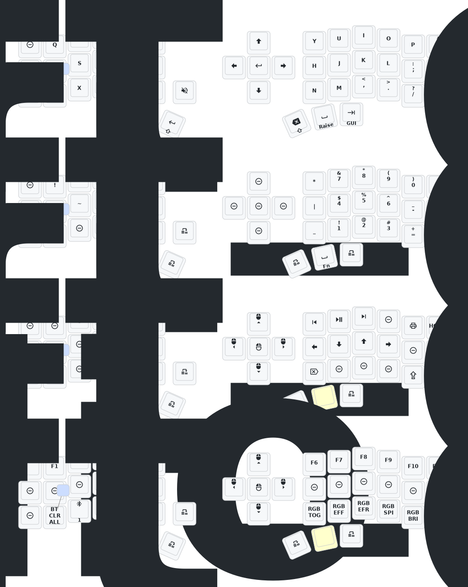

# Eyelash Corne ZMK Repository

**This keyboard is not compatible with standard `corne` firmware. Use `eyelash_corne`.**

## Setup

1. [Fork this repository](https://docs.github.com/en/get-started/quickstart/fork-a-repo#forking-a-repo).
2. [Enable GitHub Actions](https://docs.github.com/en/actions/managing-workflow-runs-and-deployments/managing-workflow-runs/disabling-and-enabling-a-workflow#enabling-a-workflow).
3. Make sure the `eyelash_corne` entry in [`config/west.yml`](config/west.yml) is valid.
4. If your fork already contains `boards/arm/eyelash_corne`, delete it.

If you already have a ZMK config repository, you can [add this repository as a module](https://zmk.dev/docs/features/modules#building-with-modules) instead of forking.

## Keymap Diagram

